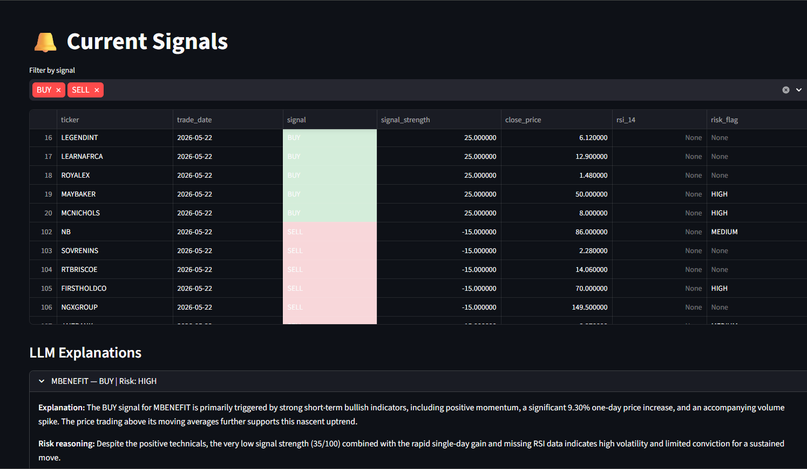
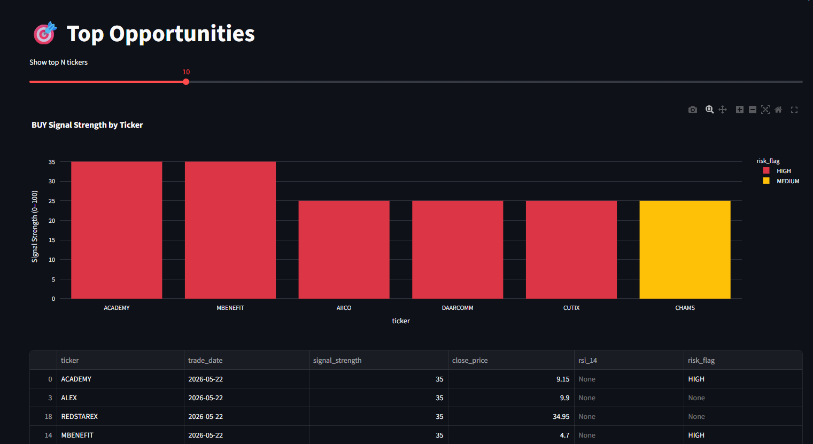
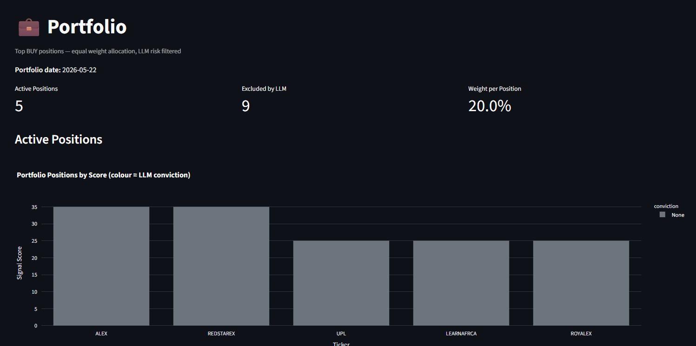
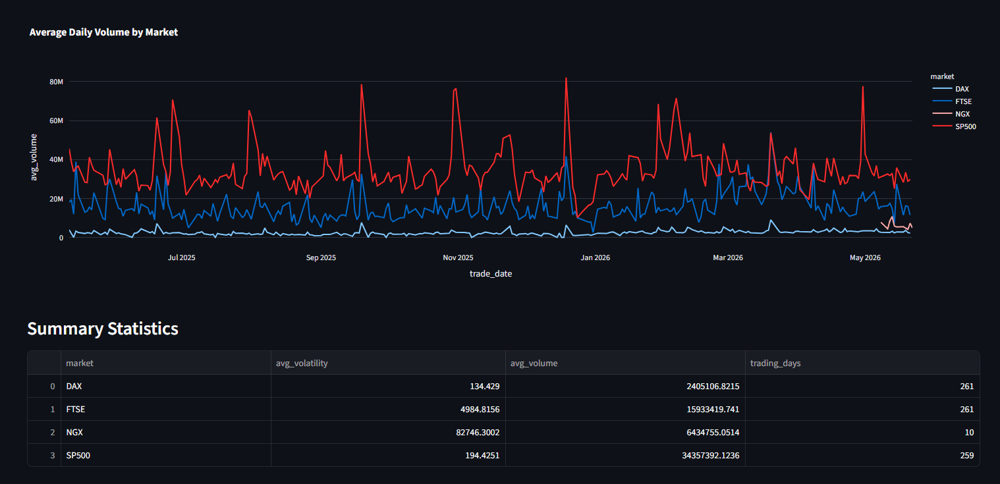

# NGX Market Signal & Decision System

> Personal investment tool designed to standardize signal generation and decision-making in a market with limited data accessibility and tooling.
> The Nigerian Stock Exchange (NGX).
> Technical signals, LLM-filtered explanations, backtesting, and NGX vs EU/US comparison.
>
> ⚠️ Disclaimer
This project is for educational and research purposes only and does not constitute financial advice. All signals and outputs are experimental and should not be used for real-world investment decisions without independent verification.

## Stack

| Layer | Tech |
|---|---|
| Language | Python 3.12 |
| Package manager | uv (native install) |
| Database | PostgreSQL 15 (port 5436) |
| ORM | SQLAlchemy 2.0 |
| Feature layer | dbt (staging → intermediate → marts) |
| Dashboard | Streamlit (port 8504) |
| LLM | Gemini 2.5 Flash (google-genai SDK) |
| Data | NGX JSON API + yfinance |
| Scheduler | APScheduler (daily at 16:00 WAT) |
| Portfolio | Decision layer (top 5, equal weight, LLM filtered) |
| Infrastructure | Docker + docker-compose |

## Pipeline Overview

```text
NGX JSON API (auto) + CSV fallback (manual)
    ↓
Daily ingestion — PostgreSQL via SQLAlchemy ORM
    ↓
dbt feature layer — staging → intermediate → fct_features
(returns, momentum, SMA/EMA, volume ratio)
    ↓
Python scoring layer — reads fct_features, applies weighted rules
BUY / SELL / HOLD + signal strength score (0–100)
    ↓
Gemini 2.5 Flash — explanation + conviction + risk flag
LLM feedback loop — adjusts score and filters high-risk signals:
  - Low conviction → score penalty (-5)
  - HIGH risk BUY → downgraded to HOLD
    ↓
Portfolio construction — top 5 BUY, equal weight (20% each)
HIGH risk positions excluded by LLM filter
    ↓
Streamlit dashboard — signals, opportunities, backtest,
                       NGX vs global, portfolio

The system follows a feature-store → scoring → decision architecture, 
where dbt acts as the feature layer, Python handles scoring, 
and the portfolio layer translates signals into actions.
```

## 📊 Dashboard Preview 

Dashboard Preview
- Current Signals (with LLM explanations)


    Shows BUY / SELL / HOLD signals with strength scores, RSI, and LLM-generated explanations including risk flags.

- Top Opportunities (Ranked Signals)


    Ranks top BUY signals by score, highlighting strongest opportunities and LLM risk classifications.

- Portfolio Construction (Decision Layer)


    Top 5 BUY signals selected, equal-weighted (20% each), with high-risk positions excluded by the LLM filter.

- NGX vs Global Markets Comparison


    Compares volatility and volume behavior between NGX and EU/US markets, highlighting differences in price discovery.


## Quick Start

```bash
# 1. Copy env file and fill in credentials
cp .env.example .env

# 2. Start database, scheduler and dashboard
docker-compose up db scheduler dashboard -d

# 3. Run ingestion manually on first launch
docker-compose run ingestion

# 4. Run dbt feature layer
cd dbt
dbt run
dbt test
cd ..

# 5. Run signal pipeline manually on first launch
docker-compose run signals

# 6. View dashboard
# http://localhost:8504
```

After first launch, ingestion runs automatically every day at 16:00 WAT.
Run dbt and signals manually after each ingestion until the scheduler
is extended to cover the full pipeline.

## Data Sources

### NGX (Nigerian Stock Exchange)
Fetched automatically from the NGX equities JSON API:
https://doclib.ngxgroup.com/REST/api/statistics/equities/

- Returns all listed equities for the current trading day
- Handles unchanged stocks (null ClosePrice → uses PrevClosingPrice)
- Falls back to local CSVs in `./data/` if API is unavailable
- Runs daily at 16:00 WAT via APScheduler

### Global Comparison (yfinance)
DAX, S&P 500, and FTSE 100 sample tickers for market behaviour
comparison against NGX.

## Architecture — dbt Feature Layer

Features are computed in dbt, not Python. This keeps analytical
logic version-controlled, testable, and reproducible.

```
staging/
stg_prices.sql          — unified NGX + global prices
stg_ngx_prices.sql      — NGX only view
stg_global_prices.sql   — global only view
stg_signals.sql         — signals + explanations joined
intermediate/
int_returns.sql          — 1d and 5d returns, momentum
int_moving_averages.sql  — SMA 10/20, EMA, volume ratio
marts/
fct_features.sql         — master feature table (one row per ticker per day)
mart_signal_performance.sql
mart_backtest_results.sql
mart_ngx_vs_global.sql
```

Run dbt after each ingestion:
```bash
cd dbt

# PowerShell
$env:POSTGRES_HOST="127.0.0.1"
$env:POSTGRES_PORT="5436"
$env:POSTGRES_DB="ngx_signals"
$env:POSTGRES_USER="ngx_user"
$env:POSTGRES_PASSWORD="your_password"

dbt run
dbt test
```

## Scoring Rules

Features come from `fct_features`. Python applies weights and ranks.

| Rule | Points | Direction |
|---|---|---|
| Momentum positive (5d) | +10 | BUY |
| SMA 10 > SMA 20 (bullish) | +15 | BUY |
| Volume spike on up day | +10 | BUY |
| Price above both MAs | +10 | BUY |
| Positive 1d return | +5 | BUY |
| Momentum negative (5d) | -10 | SELL |
| SMA 10 < SMA 20 (bearish) | -15 | SELL |
| Volume spike on down day | -10 | SELL |
| Price below both MAs | -10 | SELL |
| Negative 1d return | -5 | SELL |

Signal thresholds: BUY ≥ 25 | SELL ≤ -15 | HOLD = everything else

Gemini explanations fire for signals with strength ≥ 30.
LLM output feeds back into the system:
- conviction = Low → score -5
- risk_flag = HIGH + BUY → downgraded to HOLD
- risk_flag = HIGH → excluded from portfolio

Free tier limit: 20 requests/day — capped automatically.

Meaningful signals require minimum 20 trading days of history.

Scores represent relative signal strength and are used for ranking and portfolio selection rather than strict rule triggering.

## Project Structure

```
ngx-signal-engine/
├── ingestion/
│   ├── ngx_scraper.py        # NGX JSON API + CSV fallback
│   ├── yfinance_loader.py    # EU/US comparison data
│   ├── db_writer.py          # SQLAlchemy ORM models + upsert
│   ├── run_ingest.py         # ingestion entry point
│   └── scheduler.py          # APScheduler — daily at 16:00 WAT
├── signals/
│   ├── scoring.py            # weighted scoring from fct_features
│   ├── portfolio.py          # decision layer — construct + save portfolio
│   ├── backtester.py         # historical trade simulation
│   ├── gemini_explainer.py   # LLM explanation + risk flag
│   └── run_signals.py        # signals entry point
├── dbt/
│   └── models/
│       ├── staging/          # cleaned views over raw tables
│       ├── intermediate/     # returns and moving averages
│       └── marts/            # fct_features + analytics tables
├── dashboard/
│   ├── app.py                # Streamlit entry point
│   └── pages/
│       ├── 01_signals.py     # current BUY/SELL/HOLD + LLM explanations
│       ├── 02_opportunities.py  # top ranked BUY signals
│       ├── 03_backtest.py    # backtest results
│       ├── 04_comparison.py  # NGX vs EU/US price behaviour
│       └── 05_portfolio.py   # portfolio positions + LLM exclusions
├── sql/
│   └── init.sql              # database schema
├── data/                     # local CSV fallback (gitignored)
└── docs/
    └── screenshots/          # dashboard preview images for README
```

## Troubleshooting

**Container not picking up code changes**
```bash
docker rmi ngx-signal-engine-ingestion
docker-compose build --no-cache ingestion
```

**Orphan containers warning**
```bash
docker-compose down --remove-orphans
```

**No signals on dashboard**
Signals require 20 trading days of history minimum for momentum
and SMA features to compute. Collect daily data and re-run
dbt + signals each day.

**Dashboard showing stale signals**
Run dbt then signals manually:
```bash
cd dbt && dbt run && cd ..
docker-compose run signals
```

**Portfolio page empty**
Run signals first — portfolio is built at the end of the signal pipeline:
```bash
docker-compose run signals
```

**Gemini 503 errors**
Free tier rate limit hit. The pipeline skips and continues —
affected tickers will have no explanation but signals still save.
Only signals with strength ≥ 30 call Gemini to limit usage.

**Comparison page empty**
Run dbt first — mart_ngx_vs_global must be built.

**Check scheduler logs**
```bash
docker-compose logs scheduler
```

**Check what data is in the database**
```bash
docker exec -it ngx-signal-engine-db-1 psql -U ngx_user -d ngx_signals -c \
"SELECT COUNT(*), trade_date FROM ngx_prices GROUP BY trade_date ORDER BY trade_date DESC;"
```

## Port Reference

| Project | DB port | App port |
|---|---|---|
| P01 Instagram Fake Detector | 5432 | 8501 |
| P02 Influencer ROI Scorer | 5433 | 8502 |
| P03 Engagement Anomaly Dashboard | 5434 | 8503 |
| Tribe AdCortex | 5435 | — |
| **NGX Signal Engine** | **5436** | **8504** |
